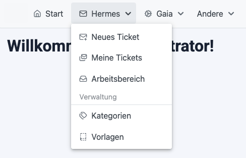

# PrimeLucide

PrimeLucide is a lightweight library that simplifies the use of icons from [Lucide](https://lucide.dev/) in PrimeFaces applications. It provides ready-to-use CSS classes for each icon and packages all required assets in a JAR that can be easily added to your project.

> **Disclaimer**: PrimeLucide is an independent project and is not affiliated with, endorsed by, or sponsored by PrimeFaces or PrimeTek.



## Installation

You can add PrimeLucide to your project via Maven:

```xml
<repositories>
    <repository>
        <id>strassburger-repo</id>
        <url>https://maven.strassburger.org</url>
    </repository>
</repositories>

<dependencies>
    <dependency>
        <groupId>org.strassburger</groupId>
        <artifactId>prime-lucide</artifactId>
        <version>1.16.0</version> <!-- Use the latest available version -->
    </dependency>
</dependencies>
```

## Usage

1. Add the PrimeLucide stylesheet to your JSF page:

```xml
<h:head>
    <h:outputStylesheet library="prime-lucide" name="prime-lucide.css" />
</h:head>
```

2. Use the CSS classes to display icons. e.g.:

```xml
<p:submenu label="Chats">
    <p:menuitem icon="pl pl-house" value="Home" outcome="/index.xhtml"/>
    <p:menuitem icon="pl pl-inbox" value="Inbox" outcome="/inbox.xhtml"/>
</p:submenu>
```

```xml
<div style="display: flex; align-items: center; gap: 10px">
    <i class="pl pl-tags" />
    <span>These are tags</span>
</div>
```

## Legal

This library is licensed under the [Apache License, Version 2.0](LICENSE).

### Icon Attribution

Icons are sourced from [Lucide](https://lucide.dev), released under the [MIT License](https://github.com/lucide-icons/lucide/blob/main/LICENSE).
